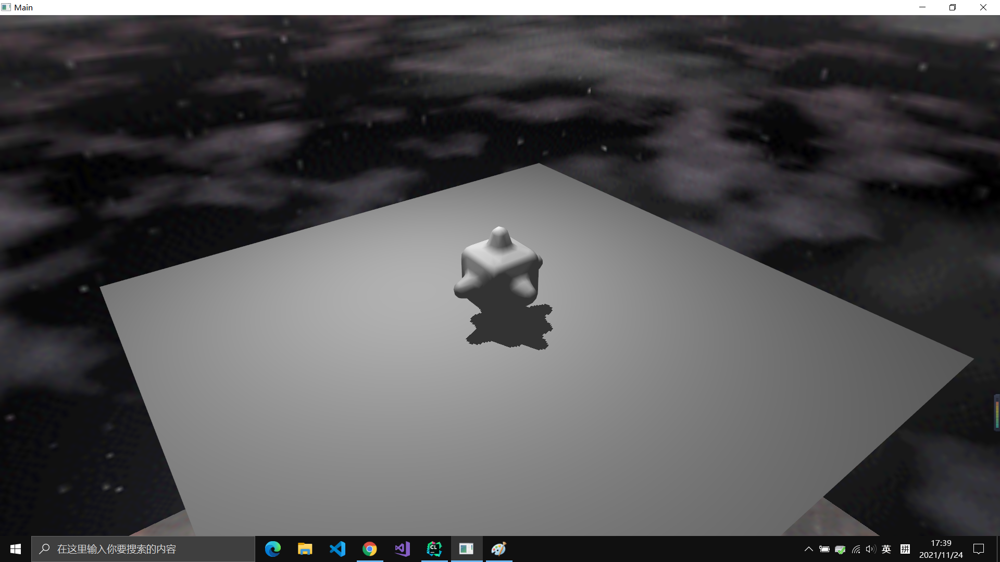
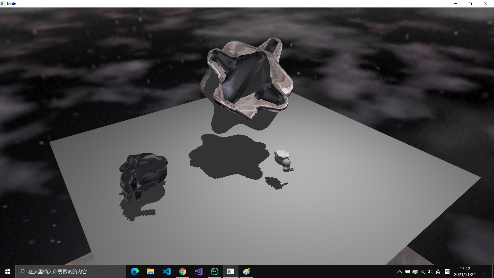

# Read me 
The directory organization is roughly the same as the base directory. 
I have added a 'data' folder to store the .off files and .png files required by the editor and a 'image' folder for this readme.

I have modified the src/main.cpp file and added a stb_image.h file to complete the assignment.

## How to operate the program
After running the program like the base directory, you will be able to see a window jumps out.
### Add/Delete objects
* press '1' to add a unit cube in the middle of the window
* press '2' to add a bumpy cube in the middle of the window
* press '3' to add a bunny in the middle of the window
* press 'ESC' to delete all objects

### Move/Change camera (using trackball)
* press '4' or '5' to rotate the camera around X axis 
* press '6' or '7' to rotate the camera around Y axis
* press '8' or '9' to rotate the camera around Z axis
* press '-' to zoom in camera
* press '+' or '=' to zoom out camera

### Move/Change objects
* left-click on an object will select it and change its color to red
* right-click on anywhere will un-select every objects
* press 'q' or 'e' to translate selected objects along X axis
* press 'a' or 'd' to translate selected objects along Y axis
* press 'z' or 'c' to translate selected objects along Z axis
* press 't' or 'u' to rotate selected objects around X axis
* press 'g' or 'j' to rotate selected objects around Y axis
* press 'b' or 'm' to rotate selected objects around Z axis
* press 'i' to scale up selected objects
* press 'o' to scale down selected objects

### Change shading 
* press 'w' will change selected objects to wireframe shading
* press 'f' will change selected objects to flat shading
* press 'p' will change selected objects to phong shading
* press 'k' will change selected objects to reflect environment mapping
* press 'l' will change selected objects to refract environment mapping

### Change shadow
* press 's' will change shadow color between black and red

## Screenshots of program
1. Start of the program

 

2. Change to full screen

 

3. Add a object

 

4. Add more objects

5. Change objects to reflect and refract mapping

 

6. Change shadow to red

7. Rotate camera

 
